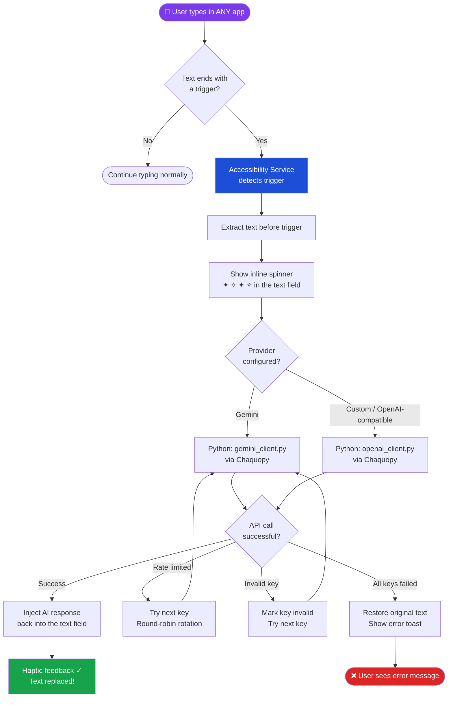
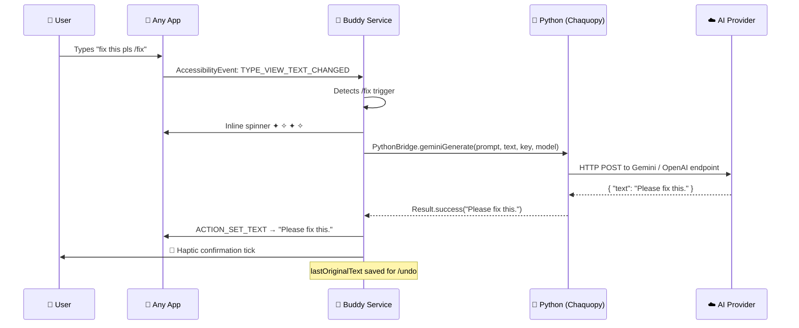

<div align="center">


<br/>
<br/>

# Buddy — AI Text Assistant

**The smartest keyboard upgrade you never had to install.**  
A native Android Accessibility Service that injects AI directly into *any* text field — in *any* app — on the fly.

<br/>

[](#installation)
[](#tech-stack)
[](#ai-providers)
[](#tech-stack)
[](#license)

<br/>

[](#download)
[](#apk-info)
[](#tech-stack)
[](#tech-stack)

<br/>

> Type a trigger like `/fix` or `/formal` at the end of any text — in any app — and watch AI rewrite it **instantly**.

<br/>

[⬇️ Download APK](#download) &nbsp;•&nbsp; [🐛 Report Bug](https://github.com/Musheer360/Buddy/issues) &nbsp;•&nbsp; [✨ Request Feature](https://github.com/Musheer360/Buddy/issues/new) &nbsp;•&nbsp; [🔨 Build from Source](#building-from-source)

</div>

---

## 📖 Table of Contents

- [What is Buddy?](#what-is-buddy)
- [How it Works — Flowchart](#how-it-works)
- [APK Info & Download](#download)
- [Getting Started](#getting-started)
- [Built-in Commands](#built-in-commands)
- [Custom Commands](#custom-commands)
- [Command Ideas](#command-ideas)
- [App Screenshots](#app-screenshots)
- [AI Providers](#ai-providers)
- [Tech Stack](#tech-stack)
- [Privacy & Security](#privacy--security)
- [Building from Source](#building-from-source)
- [Known Limitations](#known-limitations)
- [Contributing](#contributing)
- [License](#license)

---

## 💡 What is Buddy?

Buddy is a **zero-UI, zero-friction AI text companion** for Android. It lives quietly in the background as an Accessibility Service and springs to action exactly when you need it — without ever leaving your current app.

Finished typing a WhatsApp message but want it to sound more professional? Type `/formal` at the end. Wrote a rough email draft? Append `/improve`. Need a quick reply to that message? Type `/reply`. Buddy intercepts the text, sends it to your configured AI (Gemini, OpenAI, or any OpenAI-compatible endpoint), and **replaces it inline** — in under 2 seconds.

No copy-paste. No app-switching. No ChatGPT tab. Just type and trigger.

```
Input:   "plz send me the docs asap /formal"
                          ↓ (spinner animates in the text field: ✦ ✧ ✦ ✧)
Output:  "Could you please send over the documents at your earliest convenience?"
```

---

## 🔄 How it Works



### Step-by-step execution sequence



---

## 📦 Download

| Property | Value |
|:---|:---|
| **Version** | v1.0 |
| **APK Size** | ~20.4 MB (20,883 KB) |
| **Architecture** | arm64-v8a |
| **Min Android** | Android 6.0 (API 23) |
| **Target Android** | Android 15 (API 35) |

> ℹ️ **Why ~20 MB?** Buddy bundles the full **Python 3.12 interpreter** via [Chaquopy](https://chaquo.com/chaquopy/) to handle AI API calls natively inside the APK — no Termux, no server, no extra installs needed.

➡️ **[Download the latest APK from Releases →](https://github.com/Musheer360/Buddy/releases/latest)**

---

## 🚀 Getting Started

Follow these 5 simple steps to go from zero to AI-powered in under 5 minutes.

### Step 1 — Install the APK

1. Download the APK from the [Releases page](https://github.com/Musheer360/Buddy/releases/latest)
2. On your Android phone, open the downloaded `.apk` file
3. If prompted, allow **"Install from unknown sources"** for your file manager
4. Tap **Install**

### Step 2 — Get a Free API Key

Buddy works with **Google Gemini** (free tier available):

1. Visit [Google AI Studio](https://aistudio.google.com/app/apikey)
2. Sign in with your Google account
3. Click **"Create API Key"**
4. Copy the generated key (starts with `AIza...`)

> You can also use any **OpenAI-compatible** endpoint — see [AI Providers](#ai-providers).

### Step 3 — Add Your API Key in Buddy

1. Open the **Buddy** app
2. Tap the **Keys** tab (🔑)
3. Paste your API key and tap **Add**
4. You can add **multiple keys** — Buddy auto-rotates them to avoid rate limits

### Step 4 — Enable the Accessibility Service

1. On the Buddy **Dashboard**, tap **"Grant Accessibility Access"**
2. You'll be taken to Android Settings → Accessibility
3. Find **"Buddy Assistant"** and toggle it **ON**
4. Tap **"Allow"** on the confirmation dialog

### Step 5 — Start Using Buddy!

Open **any app** — WhatsApp, Gmail, Notes, Twitter — type your text, add a trigger at the end, and watch the magic happen.

```
"this meeting is boring /casual"
→ "this meeting is such a snooze 😴"
```

---

## ⚡ Built-in Commands

Buddy ships with **10 pre-configured commands** that cover everyday writing needs. The default trigger prefix is `/` but it's fully customizable in Settings.

| Trigger | What it does | Example Input | Example Output |
|:--------|:-------------|:-------------|:---------------|
| `/fix` | Grammar & spelling correction | `wat r u doing /fix` | `What are you doing?` |
| `/formal` | Professional tone rewrite | `can u send it now /formal` | `Could you please send it at your earliest convenience?` |
| `/casual` | Friendly/relaxed tone | `Please advise on your ETA /casual` | `Hey, when do you think you'll get here?` |
| `/improve` | Clarity & readability polish | `The thing not working good /improve` | `The feature isn't functioning properly.` |
| `/shorten` | Concise condensation | `I wanted to let you know that I will not be able to attend the event /shorten` | `I can't attend.` |
| `/expand` | Add detail & elaboration | `Meeting delayed /expand` | `The meeting has been postponed. We will share the updated schedule shortly.` |
| `/emoji` | Add relevant emojis | `Looking forward to the weekend /emoji` | `Looking forward to the weekend! 🎉✨🙌` |
| `/reply` | Generate a contextual reply | `Are we still on for lunch? /reply` | `Yes, absolutely! See you then!` |
| `/undo` | Revert to original text | *(after any trigger)* | Restores the text before the last AI replacement |
| `/translate:XX` | Translate to any language | `Hello, how are you /translate:hi` | `नमस्ते, आप कैसे हैं?` |

### `/translate` Language Codes — Quick Reference

| Code | Language | Code | Language | Code | Language |
|:-----|:---------|:-----|:---------|:-----|:---------|
| `en` | English | `fr` | French | `de` | German |
| `es` | Spanish | `hi` | Hindi | `ja` | Japanese |
| `zh` | Chinese | `ar` | Arabic | `pt` | Portuguese |
| `ru` | Russian | `ko` | Korean | `it` | Italian |

*Any valid [BCP 47 language code](https://www.iana.org/assignments/language-subtag-registry) works.*

---

## 🛠️ Custom Commands

Beyond the built-in set, Buddy lets you create your own trigger/prompt pairs for specialized writing tasks.

### Creating a Custom Command

1. Open the **Buddy** app
2. Tap the **Commands** tab
3. Tap the **+** button
4. Enter your **trigger** (e.g., `/tweet`)
5. Enter the **AI prompt** that defines the behavior
6. Tap **Save**

### Custom Command Examples

**`/tweet` — Twitter/X optimized post:**
```
Trigger: /tweet
Prompt:  Rewrite the provided text as an engaging tweet under 280 characters.
         Use short punchy sentences. Add 2-3 relevant hashtags. Make it viral-worthy.
         Return ONLY the tweet text with no explanations.
```

```
Input:   "Just finished building my new Android app after 3 months of work /tweet"
Output:  "3 months in the making — my Android app is finally live! 🚀
          The grind was worth it. #AndroidDev #MobileApp #BuildInPublic"
```

---

**`/review` — Professional code review comment:**
```
Trigger: /review
Prompt:  Rewrite the provided text as a polished, constructive code review comment.
         Be specific, professional, and suggest improvements clearly.
         Return ONLY the comment text.
```

```
Input:   "this function is too long and confusing /review"
Output:  "This function is doing too much. Consider extracting the validation
          logic into a separate helper method to improve readability and testability."
```

---

**`/apology` — Professional apology message:**
```
Trigger: /apology
Prompt:  Rewrite the provided text as a sincere, professional apology.
         Acknowledge the issue, take responsibility, and offer resolution.
         Return ONLY the apology text.
```

```
Input:   "sorry i messed up the project deadline /apology"
Output:  "I sincerely apologize for missing the project deadline. I take full
          responsibility for the delay and I'm working to resolve this immediately.
          I'll have it completed and reviewed by end of day today."
```

---

**`/linkedin` — LinkedIn post formatter:**
```
Trigger: /linkedin
Prompt:  Rewrite the provided text as a professional, engaging LinkedIn post.
         Use line breaks for readability, add value, and end with a call to action or question.
         Return ONLY the post text.
```

---

**`/eli5` — Explain Like I'm 5:**
```
Trigger: /eli5
Prompt:  Explain the provided text in the simplest possible terms a 5-year-old could understand.
         Use analogies and very simple words. Return ONLY the simplified explanation.
```

---

**`/subject` — Email subject line generator:**
```
Trigger: /subject
Prompt:  Generate a clear, concise, professional email subject line for the provided email body.
         Return ONLY the subject line, no "Subject:" prefix.
```

---

**`/bullet` — Convert text to bullet points:**
```
Trigger: /bullet
Prompt:  Convert the provided text into a clean, organized bullet-point list.
         Keep each bullet short. Return ONLY the bullet list.
```

---

## 💡 Command Ideas

Here are creative trigger ideas to inspire your custom command collection:

| Trigger | Use Case |
|:--------|:---------|
| `/angry` | De-escalate an angry message to something calm |
| `/hr` | Reword to be HR-friendly and workplace-safe |
| `/cold` | Format as a cold outreach email |
| `/summary` | Summarize a long piece of text |
| `/title` | Generate a blog/article title from content |
| `/seo` | Rewrite for SEO with keyword density |
| `/passive` | Convert active voice to passive voice |
| `/active` | Convert passive voice to active voice |
| `/french` | Shortcut for `/translate:fr` |
| `/rhyme` | Rewrite text with rhyming scheme |
| `/haiku` | Convert any text into a haiku |
| `/pitch` | Turn an idea into a 30-second elevator pitch |
| `/layman` | Simplify technical jargon for general audience |
| `/legal` | Add appropriate legal disclaimers |
| `/commit` | Format as a Git commit message |

---

## 📸 App Screenshots

> *Screenshots show the app's four main screens: Dashboard, API Keys, Commands, and Settings.*

<div align="center">
<table>
  <tr>
    <td align="center"><b>Dashboard</b></td>
    <td align="center"><b>API Keys</b></td>
    <td align="center"><b>Commands</b></td>
    <td align="center"><b>Settings</b></td>
  </tr>
  <tr>
    <td>Service toggle, grant accessibility, status indicator</td>
    <td>Add/remove API keys, round-robin rotation management</td>
    <td>Built-in triggers, add custom commands</td>
    <td>Choose AI provider, model, custom endpoint, prefix</td>
  </tr>
</table>
</div>

---

## 🤖 AI Providers

Buddy supports two provider modes:

### Google Gemini (Default)

| Model | Notes |
|:------|:------|
| `gemini-2.5-flash-lite` | **Default.** Ultra-fast, ideal for real-time text tasks |
| `gemini-2.0-flash` | Balanced performance with strong reasoning |
| `gemini-2.5-flash` | More capable, slightly slower |

Get your free API key at [Google AI Studio →](https://aistudio.google.com/app/apikey)

### Custom / OpenAI-Compatible

Buddy can connect to any OpenAI-compatible endpoint:

- **OpenAI** — `https://api.openai.com/v1` with `gpt-4o-mini`, `gpt-4o`, etc.
- **Groq** — `https://api.groq.com/openai/v1` with `llama-3.3-70b-versatile`
- **OpenRouter** — `https://openrouter.ai/api/v1` (access 200+ models)
- **Ollama** (local) — `http://localhost:11434/v1` with `llama3`, `mistral`, etc.
- **LM Studio** — `http://localhost:1234/v1`
- **Puter AI** — Free OpenAI-compatible tier

**Configuration:**
1. Open **Settings** in Buddy
2. Select **"Custom / OpenAI-compatible"** as provider
3. Enter your **Model name** and **Endpoint URL**
4. Add the API key in the **Keys** tab

### Multi-Key Round Robin

Add multiple API keys from the same or different accounts — Buddy **automatically rotates** through them:

- Distributes load evenly across keys
- Skips rate-limited keys and retries with the next available key
- Marks invalid/expired keys to avoid wasted calls
- Auto-recovers rate-limited keys after the cooldown window expires

---

## 🔒 Privacy & Security

Buddy is designed with a strict **privacy-first** philosophy:

### What Buddy Does NOT Do
- ❌ No analytics or telemetry — zero tracking
- ❌ No intermediary servers — your text never touches Buddy's servers (there are none)
- ❌ No data collection, storage, or logging
- ❌ No internet access except for direct AI API calls you configure
- ❌ No ads, no account required, no sign-up

### What Buddy Does
- ✅ All API keys encrypted at rest using **AES-256-GCM via Android Keystore**
- ✅ Text only leaves your device when you intentionally trigger an AI command
- ✅ Data flows **directly** from your device → your configured AI provider, nowhere else
- ✅ Accessibility Service only reads text when a trigger character is detected (not a keylogger)
- ✅ Password fields are **explicitly blocked** — Buddy never reads or modifies password inputs
- ✅ No clipboard snooping — clipboard is only touched as a fallback injection method, and the original clip is restored within 500ms

### Android Keystore Encryption Details

```
Algorithm:    AES-256-GCM
Key storage:  Android Hardware Security Module (HSM) / TEE
Key alias:    typeslate_secure_key
Padding:      NoPadding (GCM handles authentication)
IV:           Auto-generated per encryption, stored alongside ciphertext
```

Your API keys are hardware-bound — they cannot be extracted from the device even with root access.

### Permissions Required

| Permission | Reason |
|:-----------|:--------|
| `BIND_ACCESSIBILITY_SERVICE` | Core functionality — detects text changes and injects AI responses |
| `INTERNET` | Direct API calls to your configured AI provider |
| `VIBRATE` | Haptic feedback on success/failure |
| `SYSTEM_ALERT_WINDOW` | Overlay toast notifications (via `TYPE_ACCESSIBILITY_OVERLAY`) |

---

## 🧱 Tech Stack

| Layer | Technology | Details |
|:------|:-----------|:--------|
| **Language** | Kotlin 2.1 | Primary application language |
| **AI Runtime** | Python 3.12 via Chaquopy | Embedded Python interpreter in APK |
| **UI Framework** | Jetpack Compose (Material Design 3) | 4 screens: Dashboard, Keys, Commands, Settings |
| **Accessibility** | Android AccessibilityService | `TYPE_VIEW_TEXT_CHANGED` event interception |
| **Networking** | Native `HttpURLConnection` | No Retrofit, no OkHttp — zero network overhead |
| **Encryption** | AES-256-GCM + Android Keystore | Hardware-backed key storage |
| **Async** | Kotlin Coroutines + `CoroutineScope` | Structured concurrency, `SupervisorJob` |
| **Storage** | Encrypted `SharedPreferences` | Commands and settings persistence |
| **Build** | Gradle KTS + AGP 8.7.3 | Kotlin DSL build scripts |
| **Min SDK** | API 23 (Android 6.0) | ~98%+ Android device coverage |
| **Target SDK** | API 35 (Android 15) | Fully up-to-date |

### Project Architecture

```
Buddy/
├── app/src/main/
│   ├── python/
│   │   ├── gemini_client.py        ← Python: Gemini API calls
│   │   └── openai_client.py        ← Python: OpenAI-compatible API calls
│   └── java/com/buddyapp/Buddy/
│       ├── BuddyApp.kt             ← Application class, Python init
│       ├── MainActivity.kt         ← Entry point, navigation host
│       ├── api/
│       │   └── PythonBridge.kt     ← Kotlin ↔ Python interface (Chaquopy)
│       ├── service/
│       │   └── AssistantService.kt ← Accessibility Service core (trigger detection, text injection)
│       ├── manager/
│       │   ├── KeyManager.kt       ← AES-256 key storage, round-robin rotation
│       │   └── CommandManager.kt   ← Built-in + custom trigger management
│       ├── model/
│       │   └── Command.kt          ← Data model for triggers
│       └── ui/
│           ├── DashboardScreen.kt  ← Service toggle, accessibility status
│           ├── KeysScreen.kt       ← API key management
│           ├── CommandsScreen.kt   ← Trigger browser + custom command editor
│           └── SettingsScreen.kt   ← Provider, model, prefix configuration
├── build.gradle.kts                ← Project-level Gradle
└── app/build.gradle.kts            ← App-level Gradle (Chaquopy config)
```

---

## 🔨 Building from Source

> **Prerequisites:** Android Studio Hedgehog (2023.1.1) or newer, Android SDK, JDK 17

### Step 1 — Install Android Studio

Download from [developer.android.com/studio](https://developer.android.com/studio) and install with default settings (include Android SDK).

### Step 2 — Clone the Repository

```bash
git clone https://github.com/Musheer360/Buddy.git
cd Buddy
```

### Step 3 — Open in Android Studio

1. Launch Android Studio
2. Click **"Open"** (not "New Project")
3. Navigate to the cloned `Buddy` folder → click **OK**
4. Wait for **Gradle sync** to complete

> ⚠️ First sync downloads ~500 MB (Android SDK components + Chaquopy Python 3.12). This is a one-time operation.

### Step 4 — Connect a Device

1. On your Android phone: **Settings → About Phone → tap Build Number 7×** (enables Developer Mode)
2. **Settings → Developer Options → USB Debugging → ON**
3. Connect phone via USB → tap **"Allow"** when prompted on the device

> Alternatively, use an Android Emulator (API 23+) from Android Studio's AVD Manager.

### Step 5 — Build & Run

Click the **▶ Run** button (green triangle) in Android Studio toolbar.

This will:
- Compile Kotlin sources
- Bundle Python 3.12 + scripts via Chaquopy
- Install the APK on your connected device
- Launch the app automatically

First build typically takes **3–7 minutes**. Subsequent builds are much faster.

### Step 6 — Build a Release APK

```bash
# From the project root
./gradlew assembleRelease
```

Output APK: `app/build/outputs/apk/release/app-release.apk`

> You'll need a signing keystore for release builds. Generate one via **Build → Generate Signed APK** in Android Studio.

### Troubleshooting Build Issues

| Problem | Fix |
|:--------|:----|
| Gradle sync fails: "Chaquopy not found" | Check internet connection; Chaquopy downloads on first sync |
| `"Python not started"` crash on launch | Ensure `android:name=".BuddyApp"` is set in `AndroidManifest.xml` |
| APK installs but AI doesn't respond | Verify your API key in the Keys tab |
| Accessibility service not listed | Reinstall the APK, then re-check Settings → Accessibility |
| Build error about ABI filters | Edit `app/build.gradle.kts` → remove `x86_64` from `abiFilters` |
| `CheckAarMetadata` errors | Ensure all dependencies are compatible with `compileSdk 35` |

---

## ⚠️ Known Limitations

### Text Field Compatibility

Buddy uses Android's standard `ACTION_SET_TEXT` accessibility action. Most apps work perfectly. However:

- **Chrome address bar / WebViews** — Text injection may be resisted. Buddy automatically falls back to clipboard-based paste injection.
- **WeChat / aggressive wrappers** — Custom text engines may block injection entirely.
- **Some OEM keyboards** — May not fire the expected accessibility events.

### Background Service (Battery Optimization)

Aggressive OEM battery management may kill the Accessibility Service in the background:

| Manufacturer | Fix |
|:-------------|:----|
| **Xiaomi / MIUI** | Settings → Apps → Buddy → Battery Saver → No restrictions |
| **OnePlus / OxygenOS** | Settings → Battery → Battery Optimization → Buddy → Don't optimize |
| **Huawei / EMUI** | Settings → Apps → Buddy → Battery → Enable "Auto-launch" |
| **Samsung** | Settings → Device Care → Battery → Background usage limits → Exempt Buddy |

### General Notes

- Buddy requires an **active internet connection** to make AI API calls (unless using a local model via Ollama/LM Studio)
- The `?undo` command only reverts **one level** (the most recent replacement)
- Very long texts may occasionally hit AI provider **token limits** — use `/shorten` on the result if needed
- Accessibility Services must be **re-enabled** after app updates on some devices

---

## 🤝 Contributing

Contributions are warmly welcome! Here's how to get involved:

### Ways to Contribute

- 🐛 **Bug reports** — Open an [issue](https://github.com/Musheer360/Buddy/issues) with reproduction steps
- 💡 **Feature requests** — Suggest improvements via [issues](https://github.com/Musheer360/Buddy/issues/new)
- 🔧 **Code contributions** — Fork → branch → PR
- 📖 **Documentation** — Improve this README or add wiki pages
- 🌍 **Translations** — Help localize the app UI

### Pull Request Guidelines

1. Fork the repository
2. Create a feature branch: `git checkout -b feature/your-feature-name`
3. Make your changes and commit: `git commit -m "feat: add your feature"`
4. Push to your fork: `git push origin feature/your-feature-name`
5. Open a Pull Request against `main`

### Commit Message Convention

Use [Conventional Commits](https://www.conventionalcommits.org/):

```
feat:     New feature
fix:      Bug fix
docs:     Documentation change
refactor: Code restructure (no behavior change)
perf:     Performance improvement
chore:    Build or tooling change
```

---

## 📄 License

This project is licensed under the **MIT License**.

```
MIT License

Copyright (c) 2024 Musheer360

Permission is hereby granted, free of charge, to any person obtaining a copy
of this software and associated documentation files (the "Software"), to deal
in the Software without restriction, including without limitation the rights
to use, copy, modify, merge, publish, distribute, sublicense, and/or sell
copies of the Software, and to permit persons to whom the Software is
furnished to do so, subject to the following conditions:

The above copyright notice and this permission notice shall be included in all
copies or substantial portions of the Software.

THE SOFTWARE IS PROVIDED "AS IS", WITHOUT WARRANTY OF ANY KIND, EXPRESS OR
IMPLIED, INCLUDING BUT NOT LIMITED TO THE WARRANTIES OF MERCHANTABILITY,
FITNESS FOR A PARTICULAR PURPOSE AND NONINFRINGEMENT.
```

See the full [`LICENSE`](LICENSE) file for details.

---

<div align="center">

**Built with ❤️ for anyone who types too much.**

*Buddy — because your ideas deserve better words.*

<br/>

[](https://github.com/Musheer360/Buddy)

</div>
